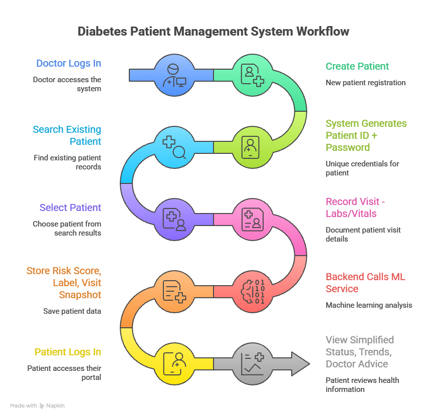

# 🩺 Diabetes Patient Management System (DPMS)
 ⚙️**React · Node.js · Express · MongoDB · Python ML (Logistic Regression + Random Forest) · GenAI (Groq / llama-3.1-8b-instant)**

A role-based preventive care platform that helps doctors detect early diabetes risk signals from routine OPD data, recommends suitable medicines with dosage, and supports timely, informed interventions—while giving patients understandable, non-alarming guidance.

🔗**🚀Live Demo URL's:**
- PROJECT: https://diabetespredictions-vert.vercel.app  
- Backend: https://diabetesprediction-backend.up.railway.app/api  
- ML Service (Diabetes Risk): https://diabetesprediction-ml.up.railway.app/predict  
- ML2 Service (Medicine Recommendation): https://diabetesprediction-ml2.up.railway.app/predict-medicine
- APK Link: https://drive.google.com/file/d/124MKNUiJtrkuiWccRBVDxhMofLTA8AB_/view?usp=sharing
- YT Link: https://www.youtube.com/watch?v=nLJ7tcZA114
---
**Demo User Credentials:**(You can also create your own🫠)
- Doctor: doctor1@gmail.com / 123456789
- Patient: P-YWX1Y67245 / sxqxsgvd8kux

## 📃 Table of contents
- [1) 📌 Overview](#1--overview)
- [2) 🎯 Why this problem + How we address it](#2--why-this-problem--how-we-address-it)
- [3) ✨ Features](#3--features)
- [4) 🔄 Workflow (OPD-friendly CDS)](#4--workflow-opd-friendly-cds)
- [5) 🤖 ML + GenAI Integration](#5--ml--genai-integration)
- [6) ⚖️ Ethics, Bias & Limitations](#6--ethics-bias--limitations)
- [7) 💼 Business Feasibility](#7--business-feasibility)
- [8) 🛠️ Tech Stack](#8--tech-stack)
- [9) 📁 Repository Structure](#9--repository-structure)
- [10) 📡 API Overview](#10--api-overview)
- [11) ⚡ Setup (Local)](#11--setup-local)
- [12) ☁️ Deployment Notes](#12--deployment-notes)
---
## 1) Overview
Diabetes often develops **silently**. This prototype converts routine structured patient inputs (e.g., **age, BMI, HbA1c, blood glucose, comorbidities, smoking history**) into:

- ✅ an ML-based **risk estimate**  
- 🏷️ a **risk category** (Low / Medium / High)  
- 🔎 **key contributing factors**  
- 🧭 **next-step guidance** (follow-up + lifestyle actions)  
- 💊 **medicine recommendation** with dosage (via ML2)  

**Two user roles:**  
- **👨‍⚕️ Doctor Portal:** Patient management, visit logging, analytics, risk prediction support, and AI-powered medicine recommendation  
- **👤 Patient Portal:** Visit trends, risk summaries, self-entry estimation, and a lifestyle-focused GenAI assistant *(non-diagnostic)*  
---
## 2) 🎯  Why this problem + how we address it
### 🔥  Motivation
In real OPD settings, doctors face:
- limited time per patient
- fragmented history across visits
- uncertainty in early-risk interpretation
- difficulty choosing the best initial medication for each patient's profile

Patients face:
- difficulty understanding probabilistic risk
- low adherence without clear next steps
- confusion about which medicines are prescribed and why
### ✅ How the system maps to the problem statement
| 🧩 Requirement | ✅ How we implement it |
|---|---|
| Transform structured data into risk estimates (with uncertainty) | Logistic Regression returns probability (`riskScore`) + `confidence` proxy |
| Identify key contributing factors / modifiable drivers | Highlights major drivers (BMI, HbA1c, glucose, smoking, etc.) |
| Communicate differently for doctors & patients | Doctor view is detailed; patient view is simplified + supportive |
| Suggest next-step actions | Follow-up + lifestyle guidance + GenAI Q&A (non-diagnostic) |
| Longitudinal tracking | Visit history + trend charts across checkups |
| Medicine recommendation based on patient profile | Random Forest classifier suggests medicine + dosage from 36 health parameters |
---
## 3) ✨ Features

### 👨‍⚕️ Doctor Portal
- 🔐 Doctor signup / login  
- 👥 Create, search, update & manage patients (CRUD)  
- 📝 Log visits (checkups) and maintain longitudinal history  
- 🎯 Trigger **ML risk prediction** per visit  
- 🤖 **AI-powered medicine recommendation** — suggests medicine name & dosage based on patient health profile  
- 📊 Analytics dashboard + charts for trends (HbA1c, glucose, BMI, etc.)  
- 🎫 Auto-generates patient credentials (**patientId + one-time password**)  

### 👤 Patient Portal
- 🔐 Secure login via doctor-issued credentials  
- 📚 View profile + visit history  
- 📈 Trend charts across visits  
- 🎯 Current risk status + key contributing factors  
- ✍️ Self-entry risk estimation (patient inputs → quick estimate)  
- 🤖 GenAI lifestyle assistant (diet/exercise/habits) — *non-diagnostic*  

### 🛡️ Security & Reliability
- 🔐 JWT authentication + **RBAC** (Doctor / Patient)  
- 🔒 Password hashing via **bcrypt**  
- ✅ Input validation + consistent error handling  
- ⏱️ Backend → ML calls include **timeout + retry** handling  
- 📦 Normalized responses for frontend stability  
---
## 4) Workflow (OPD-friendly CDS)
1. Doctor logs in
2. Doctor creates patient → system generates `patientId` + one-time password
3. Doctor records a visit (routine labs/vitals)
4. Backend calls ML service and stores:
   - risk score + risk label
   - visit snapshot values
5. Doctor triggers **medicine recommendation** → ML2 service returns suggested medicine + dosage
6. Patient logs in and sees:
   - simplified status
   - trends across visits
   - doctor advice
7. Patient can use the GenAI assistant for lifestyle questions (non-diagnostic)



---
## 5) 🤖 ML + GenAI integration
### 5.1 🧠 ML Model 1: Logistic Regression — Diabetes Risk Prediction (Python service)
- **Model:** Logistic Regression (binary classification: diabetic vs non-diabetic)
- **Dataset:** Provided with the problem statement (used for training/validation)
- **Inputs:** age, hypertension, heart disease, BMI, HbA1c, blood glucose, smoking history
- **Outputs:**
  - `riskScore` = predicted probability (0–1)
  - `riskLabel` = Low/Medium/High (threshold-based)
  - `confidence` = confidence proxy (see note below)

### 5.2 🤖 ML Model 2: Random Forest — Medicine Recommendation (Python service)
- **Model:** Random Forest Classifier (multi-class classification for medicine + dosage)
- **Dataset:** Custom health dataset (`Final_dataset_for_ML2.csv`) with 36 patient health features
- **Inputs (36 features):** Target (diabetes type), Genetic Markers, Autoantibodies, Family History, Environmental Factors, Insulin Levels, Age, BMI, Physical Activity, Dietary Habits, Blood Pressure, Cholesterol Levels, Waist Circumference, Blood Glucose Levels, Ethnicity, Socioeconomic Factors, Smoking Status, Alcohol Consumption, Glucose Tolerance Test, History of PCOS, Previous Gestational Diabetes, Pregnancy History, Weight Gain During Pregnancy, Pancreatic Health, Pulmonary Function, Cystic Fibrosis Diagnosis, Steroid Use History, Genetic Testing, Neurological Assessments, Liver Function Tests, Digestive Enzyme Levels, Urine Test, Birth Weight, Early Onset Symptoms, diabetes (0/1), HbA1c level
- **Outputs:**
  - `recommended_medicine` = predicted medicine name
  - `dosage_mg` = predicted dosage in mg
  - `medicine_confidence` = confidence score for medicine prediction
  - `dosage_confidence` = confidence score for dosage prediction
  - `all_medicine_probabilities` = probability distribution across all medicine classes
- **Preprocessing:** OneHotEncoding for categorical features, Median imputation for numeric features, `class_weight='balanced'` to handle class imbalance

### 5.3 💬 GenAI: Lifestyle Assistant (Groq / llama-3.1-8b-instant)
GenAI is integrated to improve communication and reduce doctor burden by answering common prevention questions:
- diet suggestions (what to reduce/what to include)
- exercise ideas and adherence tips
- explanations of terms like HbA1c and glucose ranges
- AI-generated doctor notes and health journey analysis

**Safety behavior**
- The assistant is instructed to avoid diagnosis, medication decisions, or emergency guidance.
- It provides educational guidance and encourages consultation with a doctor for medical decisions.

**Scope**
- GenAI is an education + coaching layer.
- Risk prediction is produced only by ML Model 1.
- Medicine recommendation is produced only by ML Model 2.
---
## 6) ⚖️ Ethics, bias & limitations
### 🛡️ Safety / non-misleading communication
- The tool communicates **risk**, not certainty.
- Medicine recommendations are **suggestions**, not prescriptions — final decision always rests with the doctor.
- Patient-facing messaging avoids alarmist diagnostic language.
- GenAI assistant is constrained to non-diagnostic lifestyle guidance.
### ⚠️ Bias considerations
- Risk models may perform differently across groups (age, gender).
- Medicine recommendation model trained on a specific dataset — may not generalize to all demographics equally.
- (Recommended evaluation) Report metrics across subgroups to detect performance gaps.
- Training data limitations can introduce bias if the dataset under-represents certain populations.
### 🔒 Privacy & security
- Role-based access ensures:
  - Doctors access only their patients
  - Patients access only their own data
- Password hashing + JWT-based sessions
### ⛔ Limitations
- Generalization depends on the provided dataset's representativeness.
- If lab values are missing or incorrect, risk estimates become less reliable.
- Medicine recommendation is an assistive tool — not a replacement for clinical judgment.
- Free-tier deployments can cause initial request delay (cold start).
---
## 7) 💼 Business feasibility
### 🎯 Who would use this
- Small to mid clinics / OPD setups
- Health camps / community screenings
- Corporate wellness programs
- Telemedicine platforms needing integrated decision support
### 💎 Value proposition
- Earlier risk visibility → earlier intervention → fewer complications
- Reduces doctor cognitive load by summarizing trends + risk drivers
- Medicine recommendation saves time in choosing initial treatment plans
- Improves patient understanding and adherence via simplified dashboards + education assistant
### 💰 Monetization options
- SaaS subscription per clinic/month
- Per-doctor seat licensing
- Paid tier for analytics (cohort risk lists, reminders, exports)
- Optional integrations with labs / EMR systems (future)
### 〰️ Implementation feasibility
- Uses low-cost web stack and lightweight ML inference
- Can be piloted in a single clinic with minimal integration requirements
---
## 8) 🛠️ Tech stack
- Frontend: React + UI libraries
- Backend: Node.js + Express
- Database: MongoDB
- ML (Risk Prediction): Python + Logistic Regression (REST API via FastAPI)
- ML (Medicine Recommendation): Python + Random Forest Classifier (REST API via FastAPI)
- GenAI: Groq API (llama-3.1-8b-instant)
- Auth: JWT + bcrypt
---
## 9) 📁 Repository structure
```bash
Diabetes/
  ├── backend/          # Node.js + Express API server
  ├── frontend/         # React web application
  ├── ML/               # Diabetes risk prediction (Logistic Regression + GenAI)
  └── ML2/              # Medicine & dosage recommendation (Random Forest)
```
---
## 10) 📡 API overview
#### Auth:

- POST /api/auth/register-doctor
- POST /api/auth/login
- POST /api/auth/login-patient
- GET /api/auth/me

#### Patients (Doctor only):

- POST /api/patients
- GET /api/patients?q=search
- GET /api/patients/:id
- PUT /api/patients/:id
- DELETE /api/patients/:id

#### Visits:

- POST /api/patients/:id/visits
- GET /api/patients/:id/visits
- GET /api/my/visits
- GET /api/my/profile

#### Prediction (Diabetes Risk):

- POST /api/predictions

#### Medicine Recommendation (ML2):

- POST /predict-medicine → returns recommended medicine + dosage
- GET /dropdown-options → returns valid dropdown values for form inputs
- GET /health → ML2 service health check

##### Standard response format:

{ "success": true, "data": {} }
{ "success": false, "message": "...", "errors": [...] }

## 11)⚡ Setup (local)
**Prerequisites:** Node.js 18+, MongoDB (local/Atlas), Python 3.11+, ML endpoints

**Backend:**
```bash
cd backend && npm install && npm run dev
```

**Frontend:**
```bash
cd frontend && npm install && npm start
```

**ML Service (Diabetes Risk):**
```bash
cd ML && py -3.11 -m venv venv && venv\Scripts\activate
pip install -r requirements.txt && python api.py
```

**ML2 Service (Medicine Recommendation):**
```bash
cd ML2 && py -3.11 -m venv venv && venv\Scripts\activate
pip install -r requirements.txt && python api.py
```

### 12) ☁️ Deployment Notes
- ✅ **Frontend:** Deployed on Vercel (fast load)  
- ✅ **Backend + ML:** Deployed on Railway free tier  
- ✅ **ML2:** Deployed on Railway / separate service  
- ⏳ **Cold start warning:** Free tier may sleep when idle → first request can take ~10–30s to wake up  

> ⚠️ If the issue still persists, kindly open the **Backend**, **ML**, and **ML2** URLs in separate Chrome windows.

