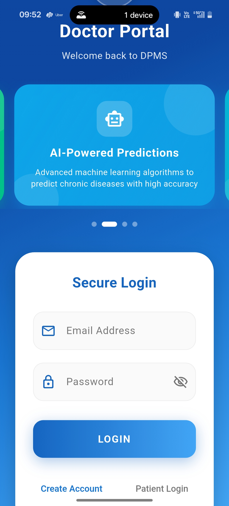
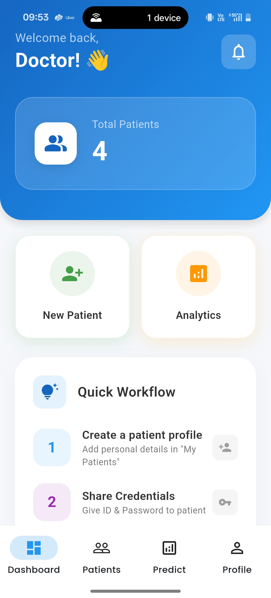
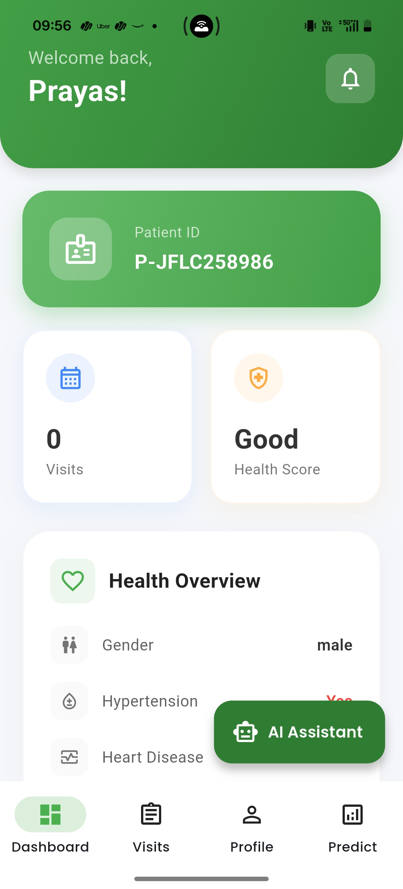
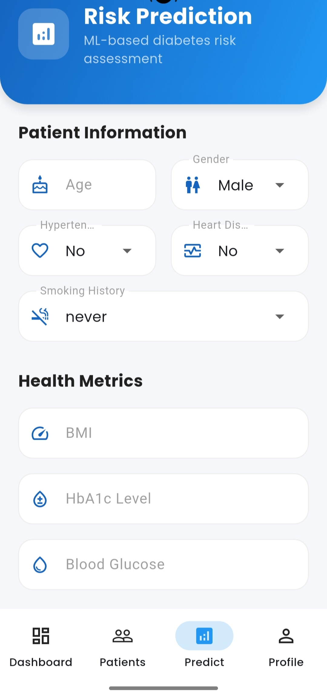
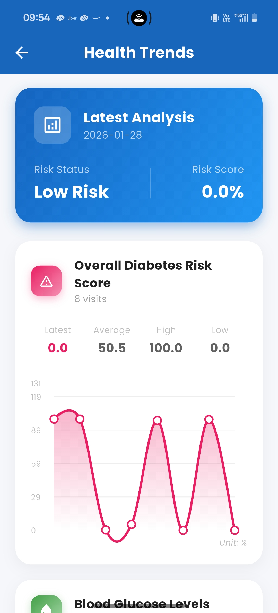
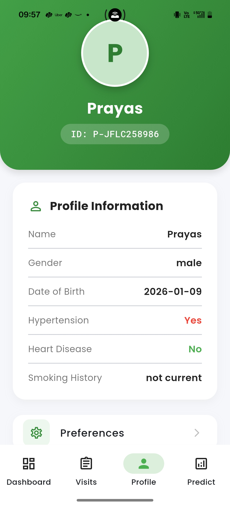

# 🏥 DPMS - Disease Prediction Management System


> **A comprehensive Flutter application for Disease Prediction Management, facilitating seamless interaction between doctors and patients with AI-powered health insights.**

---

## 📋 Table of Contents

- [Overview](#-overview)
- [Key Features](#-key-features)
- [Screenshots](#-screenshots)
- [Tech Stack](#-tech-stack)
- [Installation](#-installation)
- [Project Structure](#-project-structure)
- [API Integration](#-api-integration)
- [Contributing](#-contributing)
- [License](#-license)
- [Contact](#-contact)

---

## 📖 Overview

The **Disease Prediction Management System (DPMS)** is a cross-platform mobile application designed to bridge the gap between patients and healthcare providers. It leverages **Artificial Intelligence** to provide **accurate disease risk predictions** and **smart medicine recommendations**, enabling efficient management of patient records, visits, and health trends.

Built with **Flutter** for a smooth, native experience on Android and iOS, backed by a **Node.js** API and a **Python** ML service for advanced analytics.

---

## 🌟 Key Features

### 👨‍⚕️ For Doctors
- **Managed Dashboard**: comprehensive overview of recent activities and patient statistics.
- **Patient Records**: centralized system to view and manage patient details.
- **Health Analytics**: interactive charts regarding patient health trends.
- **AI Risk Prediction**: Advanced ML algorithms to assess patient risk levels for various diseases based on symptoms and history.
- **Medicine Recommendation**: Intelligent system suggesting potential medications to assist doctors in prescribing.
- **Visit Tracking**: Robust system to log and monitor patient visits.

### 👤 For Patients
- **Personal Health Dashboard**: track your vital stats and upcoming appointments.
- **Self-Assessment**: AI-powered tools to check symptoms and get preliminary predictions.
- **History Logs**: view past medical visits and prescriptions.
- **Secure Chat**: communicate directly with healthcare providers.
- **Privacy First**: secure local storage for sensitive personal data.

### 🚀 Core Capabilities
- **Secure Authentication**: Role-based access control (RBAC).
- **Real-time Synchronization**: Instant data updates via RESTful APIs.
- **Offline Support**: basic functionality available without internet connection.
- **Responsive Design**: optimized UI/UX for various screen sizes.

---

## 📸 Screenshots

| Login Screen | Doctor Dashboard | Patient Dashboard |
|:---:|:---:|:---:|
|  |  |  |

| Disease Prediction | Health Trends | Profile Settings |
|:---:|:---:|:---:|
|  |  |  |


---

## 🛠 Tech Stack

### Frontend (Mobile App)
- **Framework**: [Flutter](https://flutter.dev/) (SDK ^3.8.1)
- **Language**: [Dart](https://dart.dev/)
- **State Management**: [Provider](https://pub.dev/packages/provider) (^6.0.0)
- **Networking**: [Dio](https://pub.dev/packages/dio) (^5.0.0)
- **Storage**: [Flutter Secure Storage](https://pub.dev/packages/flutter_secure_storage)
- **Visualization**: [FL Chart](https://pub.dev/packages/fl_chart)
- **UI/UX**: [Google Fonts](https://pub.dev/packages/google_fonts), [Flutter Animate](https://pub.dev/packages/flutter_animate)

### Backend (API & ML)
- **API Server**: Node.js (Express)
- **ML Service**: Python (Flask/FastAPI, Scikit-learn/TensorFlow)
- **Database**: MongoDB (assumed based on Node.js stack)

---

## 💻 Installation

Follow these steps to set up the project locally.

### Prerequisites
- **Flutter SDK**: Install from [flutter.dev](https://docs.flutter.dev/get-started/install).
- **Dart SDK**: Included with Flutter.
- **IDE**: VS Code or Android Studio with Flutter extensions.
- **Backend**: Ensure the Node.js and Python services are running.

### Setup Guide

1. **Clone the Repository**
   ```bash
   git clone https://github.com/yourusername/dpms_app.git
   cd dpms_app/frontend
   ```

2. **Install Dependencies**
   ```bash
   flutter pub get
   ```

3. **Configure Environment**
   Create a `.env` file in the root directory:
   ```bash
   API_BASE_URL=http://<YOUR_BACKEND_IP>:3000
   ```

4. **Run the Application**
   ```bash
   flutter run
   ```

### Building for Production

**Android APK**
```bash
flutter build apk --release
```

**iOS Archive**
```bash
flutter build ios --release
```

---

## 📂 Project Structure

```bash
dpms_app/frontend/
├── lib/
│   ├── main.dart                 # Application entry point
│   ├── providers/                # State management (Provider)
│   │   └── auth_provider.dart
│   ├── screens/                  # UI Screens
│   │   ├── auth/                 # Login & Registration
│   │   ├── doctor/               # Doctor-specific workflows
│   │   └── patient/              # Patient-specific workflows
│   ├── services/                 # API & External services
│   │   └── api_service.dart
│   ├── widgets/                  # Reusable UI components
│   └── models/                   # Data models
├── assets/                       # Images, icons, and fonts
├── pubspec.yaml                  # Dependencies and assets config
└── README.md                     # Project documentation
```

---

## 🔌 API Integration

The frontend communicates with the backend via REST APIs. Ensure your `.env` file points to the correct backend URL.

- **Auth**: `/api/auth/login`, `/api/auth/register`
- **Patients**: `/api/patients`, `/api/patients/:id`
- **Predictions**: `/api/predict` (proxies to Python ML service)

---

## 🤝 Contributing

Contributions are welcome! Please follow these steps:

1. Fork the project.
2. Create your feature branch (`git checkout -b feature/AmazingFeature`).
3. Commit your changes (`git commit -m 'Add some AmazingFeature'`).
4. Push to the branch (`git push origin feature/AmazingFeature`).
5. Open a Pull Request.

---

## 📄 License

This project is licensed under the **MIT License**. See the [LICENSE](LICENSE) file for details.

---

## 📞 Contact

For any inquiries or support, please contact:

- **Email**: prayasharitash05@gmail.com
- **GitHub Issues**: [Report a Bug](https://github.com/yourusername/dpms_app/issues)

---

<p align="center">
  Made with ❤️ by the DPMS Team
</p>
